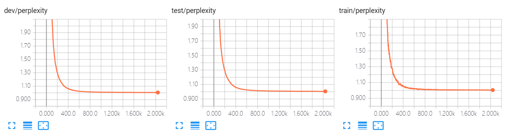

## LM -- a tensorflow implementation


An implementation of LM(language model).


### Require Packages

- contk
- TensorFlow == 1.12
- TensorBoardX >= 1.4


### Quick Start

- Downloading dataset and save it to ``./data``. (Dataset will be released soon.)
- Execute ``python run.py`` to train the model.
  - The default dataset is ``MSCOCO``. You can use ``--dataset`` to specify other ``dataloader`` class.
  - It use `gloves`  pretrained word vector by default setting. You can use ``--wvclass`` to specify ``wordvector`` class.
  - If you don't have GPUs, you can add `--cpu` for switching to CPU, but it may cost very long time.
- You can view training process by tensorboard, the log is at `./tensorboard`.
  - For example, ``tensorboard --logdir=./tensorboard``. (You have to install tensorboard first.)
- After training, execute  ``python run.py --mode test --restore best`` for test.
  - You can use ``--restore filename`` to specify checkpoints files, which are in ``./model``.
  - ``--restore last`` means last checkpoint, ``--restore best`` means best checkpoints on dev.
- Find results at ``./output``.


### Arguments

```
usage: run.py [-h] [--name NAME] [--restore RESTORE] [--mode MODE]
              [--dataset DATASET] [--datapath DATAPATH] [--epoch EPOCH]
              [--wvclass WVCLASS] [--wvpath WVPATH] [--out_dir OUT_DIR]
              [--log_dir LOG_DIR] [--model_dir MODEL_DIR]
              [--cache_dir CACHE_DIR] [--cpu] [--debug] [--cache]

A language model

optional arguments:
  -h, --help            show this help message and exit
  --name NAME           The name of your model, used for variable scope and
                        tensorboard, etc. Default: runXXXXXX_XXXXXX
                        (initialized by current time)
  --restore RESTORE     Checkpoints name to load. "last" for last checkpoints,
                        "best" for best checkpoints on dev. Attention: "last"
                        and "best" wiil cause unexpected behaviour when run 2
                        models in the same dir at the same time. Default: None
                        (don't load anything)
  --mode MODE           "train" or "test". Default: train
  --dataset DATASET     Dataloader class. Default: MSCOCO
  --datapath DATAPATH   Directory for data set. Default: ./data
  --epoch EPOCH         Epoch for trainning. Default: 10
  --wvclass WVCLASS     Wordvector class, None for using Glove pretrained
                        wordvec. Default: None
  --wvpath WVPATH       Path for pretrained wordvector. Default: wordvec
  --out_dir OUT_DIR     Output directory for test output. Default: ./output
  --log_dir LOG_DIR     Log directory for tensorboard. Default: ./tensorboard
  --model_dir MODEL_DIR
                        Checkpoints directory for model. Default: ./model
  --cache_dir CACHE_DIR
                        Checkpoints directory for cache. Default: ./cache
  --cpu                 Use cpu.
  --debug               Enter debug mode (using ptvsd).
  --cache               Use cache for speeding up load data and wordvec. (It
                        may cause problems when you switch dataset.)
```

For hyperparameter settings, please refer to `run.py`.


#### For developer

- Arguments above (except ``cache``\\``debug``) are required. You should remain the same behavior (not for implementation).
- You can add more arguments if you want.


### An example of tensorboard

Execute ``tensorboard --logdir=./tensorboard``, you will see the plot in tensorboard pages:

Following plot are shown in this model:

- loss: reconstruction loss.

  

- perplexity: reconstruction perplexity.

  


And text output:


Following text are shown in this model:

- args


### An example of test output

Execute ``python run.py --mode test --restore last``

The following output will be in `./output/[name]_test.txt`:

```
perplexity:	1.005377
This A black Old motorcycle parked in front of a garage .
This An office holder with four different types of computers .
This Two women waiting at a bench next to a street .
This A tan toilet and sink holder in a small room .
This A beautiful dessert waiting to be is by two people .
This A woman sitting on a bench in the middle of the city .
This A cat eating a bird it has holder .
This A shot of an elderly man inside a kitchen .
This A woman sitting on a bench and a woman standing behind the bench at a bus stop .
This An old man is wearing an odd hat .
This A man sleeping with his cat next to him .
This An office with desk computer and chair and laptop .
This Two white toilet with a faucet and holder .
This A woman and another woman waiting at a stop .
This Close up of a white kitchen , with a coffee is on counter .
This A white stove and cabinet inside a kitchen .
This A cat stands between two parked cars on a grassy sidewalk .
...
```

#### For developer

- You should remain similar output in this task.


### Performance

|        | Reconstruction Perplexity |
| ------ | ------------------------- |
| MSCOCO | 1.01                      |


### Author

[Qi Zhu](https://github.com/zqwerty)